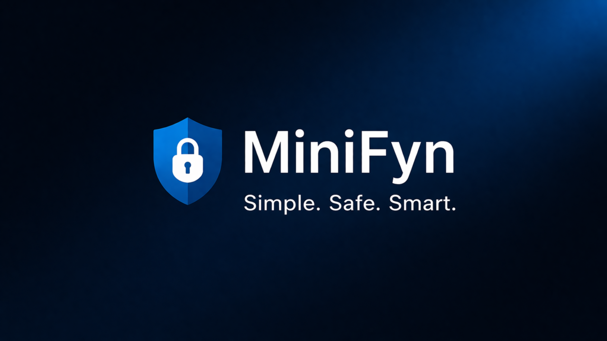
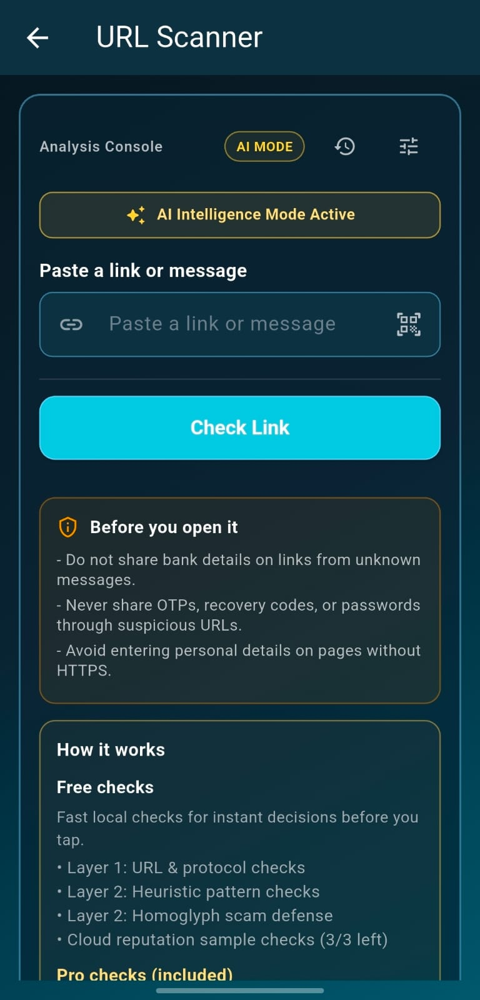

# MiniFyn

MiniFyn builds simple, practical tools for safer links and everyday web workflows.

Our work currently focuses on link utilities, QR generation, developer tools, and Android-first suspicious URL checks through ScamGuard: Link Checker.

## What we build

- **MiniFyn** - a fast URL shortener with QR code generation, analytics, and a developer API.
- **ScamGuard: Link Checker** - an Android app that helps people review suspicious URLs from SMS, email, chat, and social media before opening them.
- **ScamGuard AI** - an on-device URL risk model and signed model distribution flow for advanced link analysis.
- **Developer utilities** - focused browser tools such as JSON formatting, JWT decoding, and code minification.

## ScamGuard: Link Checker

<table>
  <tr>
    <td valign="top">
      

        <a href="https://www.minifyn.com/scamguard"><strong>ScamGuard: Link Checker</strong></a> is MiniFyn's Android app for checking suspicious links before opening them. It helps users review URLs from messages, emails, chats, and social media, with clear safety results for scam, phishing, and risky link patterns.
      

      

        Product page: <a href="https://www.minifyn.com/scamguard">minifyn.com/scamguard</a> 
        Google Play: <a href="https://play.google.com/store/apps/details?id=com.minifyn.linkguard">ScamGuard: Link Checker</a> 
        Focus: suspicious URL scanner, phishing link checker, scam link checker, Android link safety app
      

    </td>
    <td width="300" align="right" valign="top">
      
    </td>
  </tr>
</table>

## Projects

- [MiniFyn Issues](https://github.com/Minifyn/minifyn-issues) - public issue tracker for feedback, bugs, and support requests.

Most product and infrastructure repositories are private while we continue building and operating the platform.

## Links

- Website: [minifyn.com](https://www.minifyn.com)
- ScamGuard: [minifyn.com/scamguard](https://www.minifyn.com/scamguard)
- Blog: [blog.minifyn.com](https://blog.minifyn.com)
- Support: [minifyn.com/contact](https://www.minifyn.com/contact)
- Report abuse: [minifyn.com/help/report-abuse](https://www.minifyn.com/help/report-abuse)

## Principles

- Keep tools lightweight and easy to understand.
- Make safety signals clear without pretending they are absolute.
- Publish stable product, privacy, and support information.
- Build with practical user workflows first.
